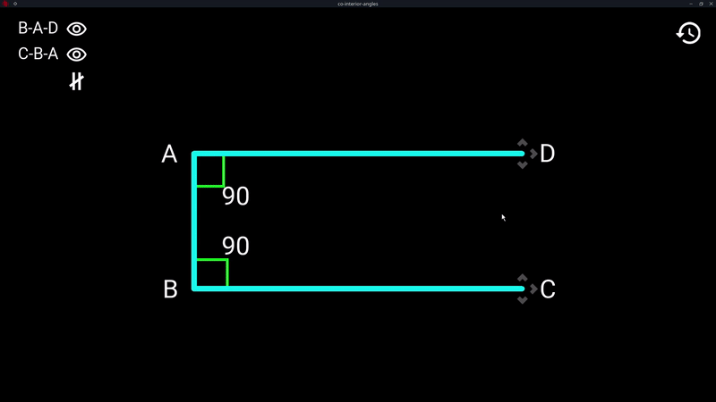

# math-simulator
This Repo contains multiple simulator apps that help students understand math more by visualizing it.

Try them: https://manerakai.itch.io/

 
 

## Donate
 &nbsp;&nbsp;

## Mirror Repos
&nbsp;&nbsp;
&nbsp;&nbsp;

## License
Copyright (C) 2021 [ManeraKai](https://github.com/ManeraKai)

[GNU General Public License](./LICENSE)
